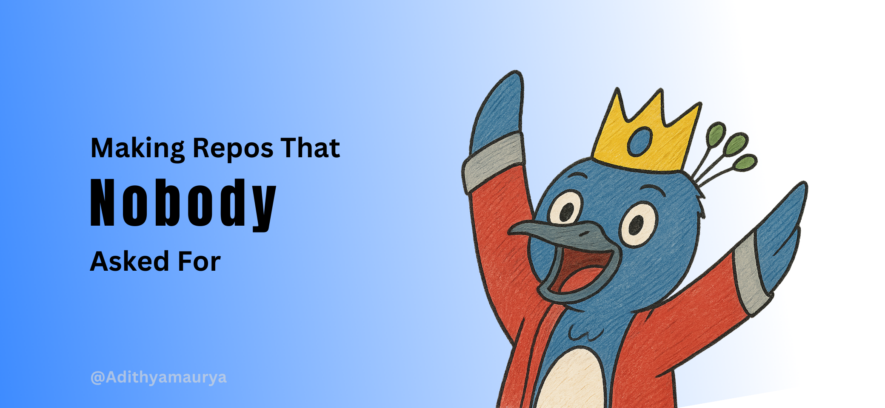

###  Tech I Touch

```text
JavaScript, React, Node.js, MongoDB, HTML, CSS, Python, Git
```

<div align="center">
  <a href="https://www.linkedin.com/in/adithya-maurya-17a00a370/">
    
  </a>
  <a href="mailto:adithyama012@gmail.com">
    
  </a>
  <a href="https://portfolio.vercel.app">
    
  </a>
</div>
# CORUJA :: GITHUB ACTIVITY

> Aggregated contribution metrics across all public repositories.

---

## 📊 Contribution Overview


---

## ⌁ Commit Intelligence

- **Scope**: All public repositories  
- **Metric**: Total commits (merged + direct)
- **Update Mode**: Real-time (GitHub API)
- **Accuracy**: Repository-verified

---

## ⌁ Notes

- Commit count includes contributions across multiple projects  
- Private repo commits are included *only if GitHub allows visibility*  
- This panel reflects **actual development activity**, not streaks or vanity metrics  

---

`STATUS: ACTIVE`
